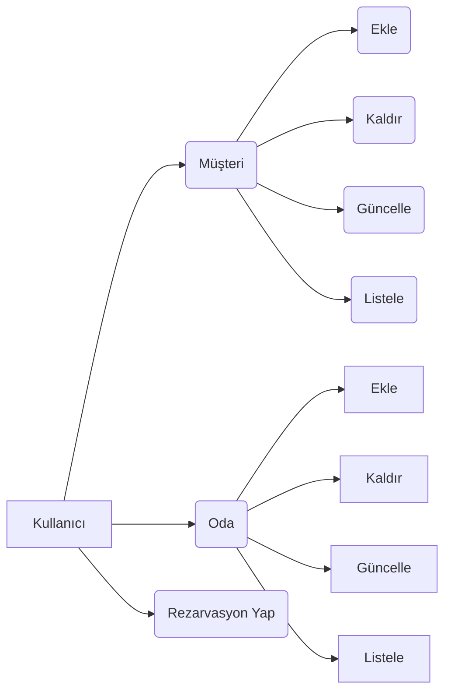
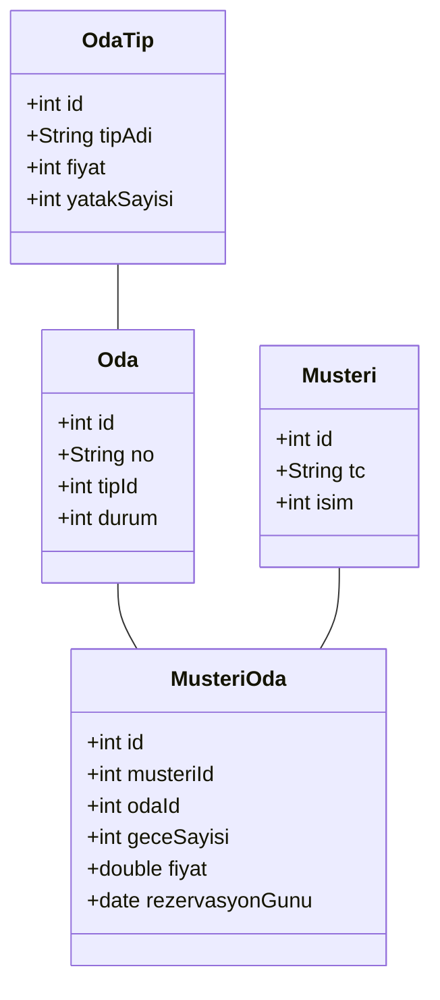

# Otel Otomasyonu Projesi
## Proje Planlaması
### Müşteri İhtiyaçları
- Oda bilgilerinin tutulabilmesi.
- Müşteri bilgilerinin tutulabilmesi.
- Rezervasyon sisteminin olması.
- Toplam ciro hesabı.
### Projenin Sınırları
- Oda ve müşteri tablolarında ekle, güncelle, kaldır ve listele fonksiyonlarının bulunması.
### Görevler
| No | Görev Adı |Süresi | 
|--|--|--|
| 1 | Kullanılacak araçların belirlenmesi | 1 gün |
| 2 | Veritabanı ağanın kurulması | 1 gün |
| 3 | Arayüz tasarımı planlaması | 2 gün |
| 4 | Arayüz yapımı | 1 gün |
| 5 | Arkayüz planlaması | 1 gün |
| 6 | Arkayüz kodlaması | 1 gün |
| 7 | Projenin sınanması | 2 gün |
| 8 | Hataların giderilmesi | 2 gün |

### Potansiyel Riskler
| Risk Açıklaması | Risk Düzeyi | Projeye Etki Düzeyi | Çözüm Yöntemleri |
|--|--|--|--|
| Aynı numaralı odaların eklenmesi | Yüksek | Yüksek | Instert işlemi sırasında aynı numaralı kayıt var mı kontrolünün sağlanması. |
| Aynı tarih içinde birden fazla rezervasyon yapma | Yüksek | Yüksek | Instert işlemi sırasında aynı tarih içinde kayıt var mı kontrolünün sağlanması. |
| Aynı isimli oda tipinin eklenmesi | Yüksek | Yüksek | Instert işlemi sırasında aynı isimli kayıt var mı kontrolünün sağlanması. |

### Kullanılacak Teknolojiler Ve Araçlar
- **Visual Studio 2022**
-  **Canva**: Proje arayüzünün örnek çiziminin yapılması için kullanılan uygulama.
- **MySQL**: Veritabanı teknolojisi.

### Fonksiyonel Diagramların Kurulması

